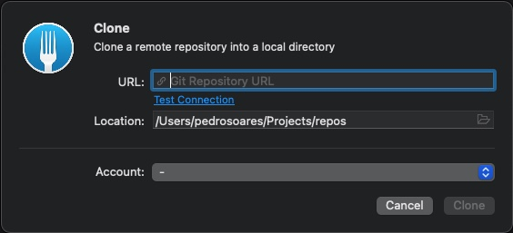
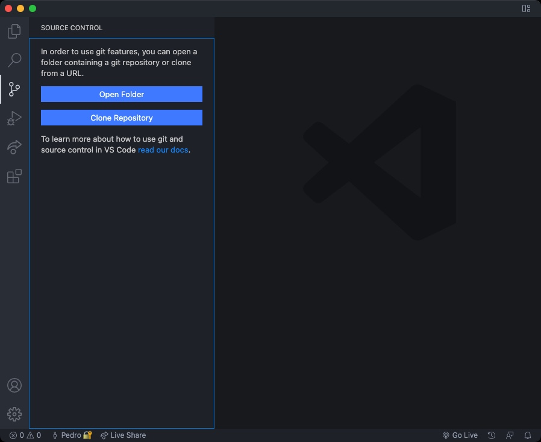

# Clone Repository

Sounds easy and actually is! 😁

> Clone is the action to download a repository into your workspace

## Using Fork

1. Go to Fork's **File** menu and click on the **Clone** option
1. Paste the repository URL that you want to clone

1. Choose the directory where you want to clone the repository
1. Choose the account (if it's not already chosen)
1. Click the **Clone** button

## Using Terminal

Go to the directory where you want to clone the repository

```bash
  cd my-directory
```

```bash
  git clone https://github.com/from-zero-to-fullstack/repository-name.git
```

## Using Visual Studio Code

1. Go to **Source Control** left menu option
1. Click the **Clone Repository** button


Now you can analyse the code, implementing new features or even fix some bugs 🚀