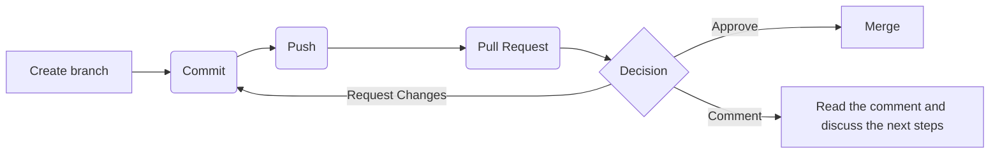

# Development Workflow

## Diagram

## Steps

1. Fetch

1. Pull

1. Create a new branch (from development branch) and categorize it
   - feature
   - bugfix
   
   examples:
      - `feature/copy-to-clipboard`
      - `bugfix/person-age`

1. Apply the changes

1. Commit

1. Push

1. Create a Pull Request
   - source branch: `branch-name` (created in step 1)
   - target branch: `development`
   - add at least one reviewer

### The Pull Request was Approved

1. Merge de Pull Request
1. Delete the source branch

### It was added a comment in the Pull Request

1. Read the comment
1. Discuss the next steps

### Changes were requested

#### If you do not agree

1. Reply via GitHub or via Discord app sharing your thoughts

#### If you agree

1. Get back to step 2.

> Note that, if the Pull Request is open yet, you don't need to create a new one. You just need to commit the changes in the same branch as before and the Pull Request will have that new commits in count.

Lets build some code! 👩‍💻
